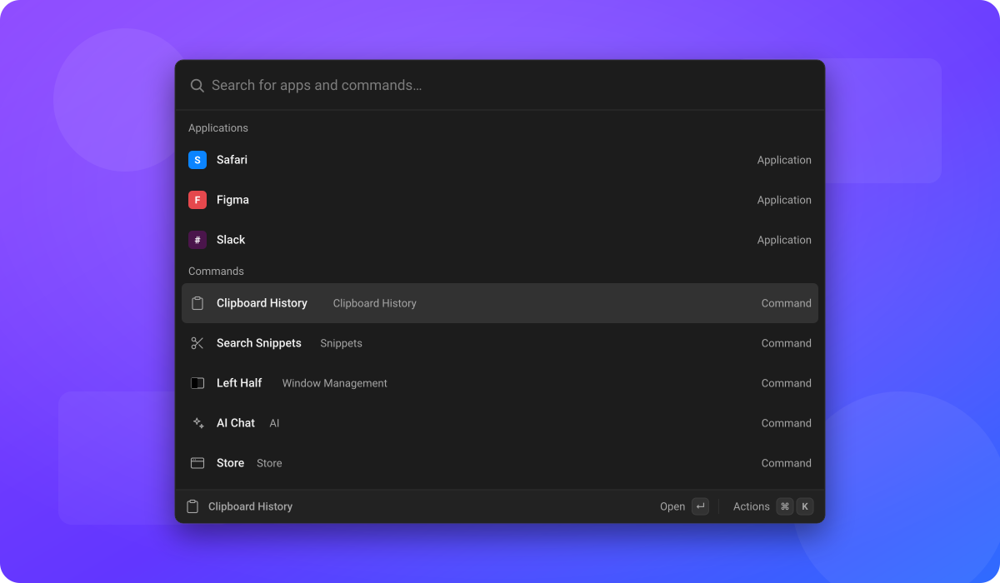

<div align="center">


# OpenRay

**One hotkey. Everything you do.**

An open-source command palette and launcher for macOS, Windows and Linux —
where almost everything, including the features that ship with it, is an extension.

[**Download**](https://github.com/tuanpham-dev/openray/releases/latest) ·
[**Documentation**](https://tuanpham-dev.github.io/openray/docs) ·
[**Website**](https://tuanpham-dev.github.io/openray/)

</div>

<br>



<br>

## What you get

Press one hotkey and everything is in the same search box. No modes, no menus,
and the thing you reach for most is already at the top.

| | |
| --- | --- |
| **[Application search](https://tuanpham-dev.github.io/openray/docs/features/applications)** | Launch anything installed, ordered by what you actually use |
| **[Clipboard History](https://tuanpham-dev.github.io/openray/docs/features/clipboard-history)** | Everything you have copied, searchable by type |
| **[Snippets](https://tuanpham-dev.github.io/openray/docs/features/snippets)** | Reusable text with placeholders, expanded as you type in any app |
| **[Quicklinks](https://tuanpham-dev.github.io/openray/docs/features/quicklinks)** | Links with a value dropped into them |
| **[Window Management](https://tuanpham-dev.github.io/openray/docs/features/window-management)** | 35 tiling presets, custom layouts, cycling half sizes |
| **[Switch Windows](https://tuanpham-dev.github.io/openray/docs/features/switch-windows)** | Jump to any open window by its title |
| **[AI](https://tuanpham-dev.github.io/openray/docs/features/ai)** | Chat, commands, agents and MCP tools, with your own API key |
| **[Calculator](https://tuanpham-dev.github.io/openray/docs/features/calculator)** | Arithmetic, unit conversion and date maths as you type |
| **[Translate](https://tuanpham-dev.github.io/openray/docs/features/translate)** | 109 languages inline. No API key, no account |
| **[Screenshots](https://tuanpham-dev.github.io/openray/docs/features/screenshots)** | Search screenshots by the text inside them |
| **[Notes](https://tuanpham-dev.github.io/openray/docs/features/notes)** | A floating markdown scratchpad with quick capture |
| **[File Search](https://tuanpham-dev.github.io/openray/docs/features/file-search)** | Find files by name across the folders you choose |
| **[Script Commands](https://tuanpham-dev.github.io/openray/docs/features/script-commands)** | Any script becomes a command with a comment header |
| **[System Commands](https://tuanpham-dev.github.io/openray/docs/features/system-commands)** | Lock, sleep, restart, volume and media |
| **[Emoji & Symbols](https://tuanpham-dev.github.io/openray/docs/features/emoji)** | Search by name, paste anywhere |
| **[Menu Bar Search](https://tuanpham-dev.github.io/openray/docs/features/menu-bar-search)** | Trigger any menu item of the app you were in |

## Works with Raycast extensions

OpenRay implements a `@raycast/api`-compatible runtime, so extensions written for
Raycast build and run here. Install from any registry, a packed archive, or a
folder you are working on — and a registry is just a static directory of files,
so there is no backend to run.

Every install starts with one registry already added, and you can remove it.
See [The Store](https://tuanpham-dev.github.io/openray/docs/extensions/store).

## Download

Installers for every platform are on the
[Releases page](https://github.com/tuanpham-dev/openray/releases/latest).

- **macOS** — Apple Silicon, `.dmg`
- **Windows** — x64, `.msi` or `.exe`
- **Linux** — x64 and arm64, `.deb`, `.rpm` or `.AppImage`

### macOS: one extra step

The Mac builds are **not signed or notarised** — that needs a paid Apple Developer account. So
Gatekeeper quarantines the download, and macOS will refuse to open it or claim the app "is
damaged and can't be opened".

Nothing is damaged. Move the app to Applications, then clear the quarantine flag once:

```sh
xattr -cr /Applications/openray.app
```

More detail, including what that command actually does, is in the
[macOS notes](https://tuanpham-dev.github.io/openray/docs/platforms/macos).

Then see [First run](https://tuanpham-dev.github.io/openray/docs/getting-started/first-run)
for the hotkey and the permissions pasting needs.

## Documentation

- [Getting started](https://tuanpham-dev.github.io/openray/docs/getting-started/install)
- [Keyboard shortcuts](https://tuanpham-dev.github.io/openray/docs/getting-started/keyboard-shortcuts)
- [Writing an extension](https://tuanpham-dev.github.io/openray/docs/developers/writing-extensions)
- [Architecture](https://tuanpham-dev.github.io/openray/docs/developers/architecture)
- [FAQ](https://tuanpham-dev.github.io/openray/docs/faq)

## Build from source

```sh
pnpm install
pnpm fetch:node-sidecar
pnpm dev
```

Full instructions, including the icon pipeline and the checks CI runs, are in
[Building from source](https://tuanpham-dev.github.io/openray/docs/developers/building-from-source).

## License

MIT. See [LICENSE](LICENSE).
